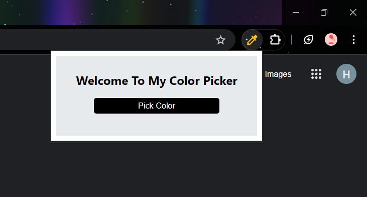

# Color Picker Chrome Extension

Color Picker is a simple Chrome extension that enables users to pick any color from a webpage and copy the Hex code to the clipboard.

## Features

- Pick any color from a webpage.
- Copy the Hex code of the selected color to the clipboard.
- Can clear the memory whenever required.
- Easy to use interface.

## Usage

- Click on the Color Picker extension icon in the Chrome toolbar.
- The cursor will change to a crosshair. Click on any color on the webpage to select it.
- The Hex code of the selected color will be displayed and automatically copied to the clipboard.

## Example
 - 
 - 
 - 